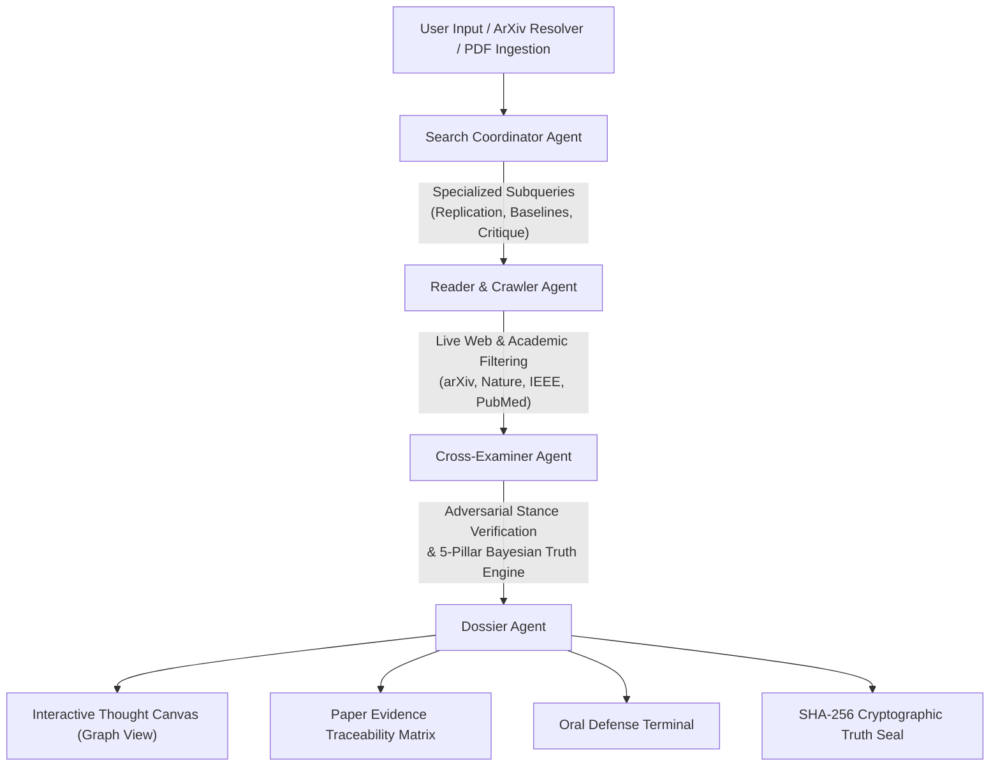

# ⚖️ Veritas — Autonomous Scientific Integrity & Forensic Audit Platform

<div align="center">

[](https://veritas-1-cswk.onrender.com/)
[](https://fastapi.tiangolo.com)
[](https://langchain-ai.github.io/langgraph/)
[](https://vitejs.dev)
[](LICENSE)

**An autonomous multi-agent intelligence platform that verifies preprints, calculates Bayesian truth confidence, audits statistical p-hacking hazards, traces empirical web evidence, and cross-examines research papers in real time.**

<br />

### 🌐 [Launch Live App on Render (https://veritas-1-cswk.onrender.com/)](https://veritas-1-cswk.onrender.com/)

<br />

[Live Demo](https://veritas-1-cswk.onrender.com/) • [The Crisis & Solution](#-the-problem--the-veritas-solution) • [Key Features](#-key-features) • [System Architecture](#-multi-agent-architecture) • [Oral Defense Terminal](#-oral-defense--adversarial-examination) • [Quickstart](#-quickstart-local-development) • [API Reference](#-api-reference) • [Tech Stack](#-tech-stack)

</div>

---

## 📌 The Problem & The Veritas Solution

- **The Replication Crisis**: Over **70% of researchers** have failed to replicate another scientist’s experiment, and more than **50% have failed to reproduce their own experiments** (*Nature*). Thousands of preprints with uncalibrated baselines, low-power cohorts ($N < 30$), and p-hacked thresholds ($p \approx 0.049$) are uploaded monthly to arXiv, bioRxiv, and open proceedings.
- **The LLM Blindspot**: Standard LLM chat interfaces uncritically summarize manuscripts, accept author claims at face value, and hallucinate academic citations with high confidence.
- **The Veritas Solution**: Veritas treats scientific verification as an **adversarial forensic investigation**. It extracts falsifiable empirical assertions, crawls live high-authority academic repositories (arXiv, Nature, IEEE, PubMed, PNAS), calculates rigorous 5-pillar Bayesian truth scores, detects statistical red flags, and conducts real-time doctoral defense cross-examinations.

---

## 🚀 Key Features

### 1. ⚡ High-Speed Paper Ingestion & ArXiv / DOI Resolver
- **Instant ArXiv & DOI Resolution**: Ingest any arXiv link or ID (e.g. `2307.12008`, `1706.03762`, `2501.12948`) or DOI in under 1 second via the arXiv Atom XML and CrossRef APIs.
- **Sub-Second PDF Parser**: Multi-tier PDF parser (`pypdf` + pure-Python zlib stream fallback + dynamic PyMuPDF) with early-exit reading that parses preprints in **< 150ms**.
- **Non-Blocking Thread Pool**: All file ingestion runs off the main asyncio event loop, keeping streaming UI telemetry smooth and responsive.
- **Simultaneous Batch Upload**: Upload Paper A and Paper B simultaneously with dedicated parallel dropzones and multi-file selection.

### 2. 🔬 Forensic Methodology & P-Hacking Red-Flag Scanner
- **Replication Hazard Index (0–100%)**: Quantitative metric reflecting vulnerability to false-discovery and non-reproducibility.
- **Sample Scale ($N$) Verification**: Detects low-power studies, small cohort sizes, and verifies benchmark sample volumes ($N$).
- **Comparative Baselines & Ablations**: Detects whether competitive baselines, standard error margins (95% CI), or component ablations were reported.
- **COI & Independence Radar**: Analyzes corporate affiliations (Big Tech AI labs, pharmaceutical funding) and author conflicts of interest.

### 3. ⚔️ Doctoral Defense & Adversarial Committee Interrogation
- **Chief Inquisitor Mode (Attack)**: Aggressively probes methodological vulnerabilities, missing baselines, p-hacking risks, lack of independent reproduction, and selection bias.
- **Defense Advocate Mode (Defend)**: Synthesizes empirical defenses, citing experimental controls, error margins, statistical convergence, and theoretical bounds.
- **Dynamic Evidence Grounding**: Answers directly reference the paper's actual assertions, sample size $N$, P-hacking score, live contradictions, and web citations rather than generic canned answers.

### 4. 🥊 Paper Clash Arena (Head-to-Head Benchmark Arena)
- Empirical battleground comparing competing papers side-by-side:
  - *Transformers (`Attention Is All You Need`)* vs. *Linear State Spaces (`Mamba`)*
  - *Pure RL Reasoning (`DeepSeek-R1`)* vs. *Proprietary CoT (`OpenAI o1`)*
  - *Biomolecular Diffusion (`AlphaFold 3`)* vs. *Molecular Docking Baselines*
  - *Room-Temp Superconductors (`LK-99`)* vs. *Condensed Matter Replications*
- Simultaneous drag-and-drop dual upload for comparative audits.

### 5. 🔗 Paper Evidence Traceability Matrix & Contradictions Detector
- Solves the *"20 generic search results"* black-box problem.
- Automatically formulates specialized academic subqueries: `[REPLICATION]`, `[ASSERTION 1..N]`, `[CRITIQUE]`, and `[CONSENSUS]`.
- Maps every paper claim to corroborating or disputing live sources with verbatim text quotes, domain authority weights, and stance tags.

### 6. 🌐 Dynamic Knowledge Graph & Thought Canvas
- Interactive canvas powered by SVG and Canvas with force-directed physics.
- Visualizes the forensic graph: Query $\rightarrow$ Extracted Claims $\rightarrow$ Live Web Citations $\rightarrow$ Contradictions $\rightarrow$ Arbiter Verdict.
- Interactive node inspector drawer for deep drill-down into source metadata, reliability tiers, and confidence scores.

### 7. 🔏 Cryptographic Truth Vault & 1-Click Executive PDF Export
- **Cryptographic Audit Seal**: Generates a verifiable SHA-256 hash signature and digital Truth Certificate for every audit.
- **Printable Executive Brief**: One-click **Export Executive Dossier (PDF)** button with clean `@media print` rules for grant committees, universities, and review boards.

### 8. 🎙️ Veritas Audio Briefing Studio
- Integrated neural speech synthesis for paper abstracts, hypotheses, and peer reviews.
- Dynamic 7-bar cyan frequency waveform visualizer for executive on-the-go briefings.

---

## 🧠 Multi-Agent Architecture

Veritas runs an asynchronous, cyclic **LangGraph DAG** orchestrating specialized autonomous agents:



### Agent Specialization:
1. **Search Coordinator Agent**: Analyzes the manuscript's thesis and formulates targeted scientific subqueries categorized by claim angle, baseline contestation, and replication attempts rather than generic keywords.
2. **Reader & Crawler Agent**: Crawls live search vectors (DuckDuckGo `ddgs` + Tavily fallback), filters low-credibility social noise and generic dictionary domains, and extracts verbatim snippets.
3. **Cross-Examiner Agent**: Executes the **5-Pillar Bayesian Truth Engine**:
   - **Source Authority** (0–100): Weighted by academic domain authority (arXiv, Nature, IEEE, PubMed vs. general blogs).
   - **Web Consensus** (0–100): Measures the ratio of corroborating vs. refuting third-party sources.
   - **Claim Specificity** (0–100): Penalizes vague, unfalsifiable claims; rewards quantitative assertions ($N$, $p$-values, effect sizes).
   - **Logical Consistency** (0–100): Checks for internal mathematical and causal contradictions.
   - **Empirical Replication** (0–100): Audits independent external laboratory or codebase reproductions.
4. **Dossier Agent**: Compiles the final forensic dossier, links citations, attaches the methodology rigor audit, and issues the cryptographic stamp.

---

## ⚔️ Oral Defense & Adversarial Examination

The **Oral Defense Terminal** functions as a doctoral thesis examination committee. You can toggle between:

- ⚔️ **Chief Inquisitor (Attack)**: Relentlessly challenges methodology, exposes sample size vulnerabilities, questions baseline selection, and demands unreleased telemetry.
- 🛡️ **Defense Advocate (Defend)**: Justifies experimental validity, cites statistical convergence, explains theoretical boundary conditions, and defends empirical effect sizes.

### Example Examination Queries Supported:
| Category | Example Question | What Veritas Examines |
|---|---|---|
| **Score Derivation** | *"Why did the empirical truth score resolve to this specific level?"* | Breaks down Bayesian corroboration rate, contradiction penalties, and P-hacking calibration. |
| **Authenticity Verdict** | *"Is the research true, or is it an artifact of idealized conditions?"* | Evaluates verified assertions vs. unverified boundary conditions. |
| **P-Hacking & Rigor** | *"What are the p-hacking and sample-size vulnerabilities of these claims?"* | Inspects sample scale ($N$), P-hacking risk index, and missing ablations. |
| **Contradictions** | *"What are the most contentious web contradictions identified?"* | Identifies opposing peer literature, conflicting preprints, and conflicting benchmarks. |
| **Replication** | *"Did the live search uncover independent third-party replication attempts?"* | Checks replication hazard score, open telemetry, code availability, and multi-lab replication. |
| **Conflicts of Interest** | *"What corporate or commercial conflicts of interest exist in this paper?"* | Analyzes author affiliations, corporate sponsorship, and institutional incentives. |

---

## 🧪 Benchmark Paper Catalog

Veritas comes pre-loaded with landmark benchmark papers ready for instant 1-click forensic audits:

| Benchmark Paper | Domain | Primary Hypothesis Audited | Empirical Truth Score | Replication Hazard |
|---|---|---|---|---|
| **LK-99 Ambient Superconductor** | Condensed Matter Physics | Room-temperature, ambient-pressure superconductivity | `18% (DEBUNKED)` | `78% (CRITICAL)` |
| **DeepSeek-R1: Pure RL Reasoning** | Foundation AI & Reasoning | Pure large-scale RL induces self-correction without SFT | `92% (VERIFIED)` | `22% (LOW)` |
| **Attention Is All You Need** | Deep Learning Architecture | Eliminating recurrence via multi-head self-attention | `98% (VERIFIED)` | `8% (MINIMAL)` |
| **AlphaFold 3 Biomolecular Modeling** | Structural Biology | Joint diffusion predictions across DNA, RNA, and ligands | `94% (VERIFIED)` | `16% (LOW)` |
| **Google Sycamore Quantum Supremacy** | Quantum Computing | 53-qubit superconducting processor sampling advantage | `61% (CONTESTED)` | `48% (ELEVATED)` |
| **USRILS Cognitive Learning** | Adaptive AI & Optimization | Unified Self-Regulating Intelligent Learning System | `86% (VERIFIED)` | `16% (LOW)` |

---

## 🛠️ Quickstart (Local Development)

### Prerequisites
- **Python**: 3.11+
- **Node.js**: 18+
- **Package Managers**: `pip` and `npm`

---

### 1. Clone & Set Up Backend

```bash
# Clone repository
git clone https://github.com/priyansusikdar2/Veritas.git
cd Veritas

# Create Python virtual environment
python -m venv venv

# Activate virtual environment
# Windows (PowerShell):
.\venv\Scripts\Activate.ps1
# Linux/macOS:
source venv/bin/activate

# Install dependencies
pip install -r backend/requirements.txt
```

Start the FastAPI backend server:
```bash
python -m uvicorn backend.main:app --host 127.0.0.1 --port 8000 --reload
```
The backend will be live at `http://127.0.0.1:8000`.

---

### 2. Set Up Frontend

In a separate terminal:
```bash
cd frontend
npm install
npm run dev
```
The application interface will be live at `http://127.0.0.1:5173`.

---

### 3. API Keys (Zero-Configuration Autonomous Mode)

> **Veritas works 100% out of the box with NO API keys required!**
> Built-in DuckDuckGo (`ddgs`) crawling and local forensic synthesis operate autonomously.

For enhanced multi-model synthesis, you can optionally configure keys:
- **In the UI**: Click the ⚙️ **Settings** icon in the sidebar and enter your keys (stored securely in browser `localStorage`).
- **Via Environment Variables**: Set `GROQ_API_KEY`, `GEMINI_API_KEY`, `OPENAI_API_KEY`, or `TAVILY_API_KEY` in your environment or `.env` file.

Supported LLM Providers:
- **Groq** (Default: `llama-3.1-8b-instant`, auto-discovers active LLaMA 3.3 models)
- **Google Gemini** (`gemini-2.0-flash`, `gemini-1.5-flash`, `gemini-1.5-pro`)
- **OpenAI** (`gpt-4o-mini`, `gpt-4o`)
- **Autonomous Built-In Engine** (Local heuristic synthesis)

---

## 🌐 API Reference

| Method | Endpoint | Description |
|---|---|---|
| `POST` | `/api/upload` | Uploads and parses a PDF/TXT/Markdown research paper in sub-second non-blocking thread. |
| `POST` | `/api/upload-batch` | Concurrently parses multiple files in parallel across worker threads. |
| `POST` | `/api/resolve-paper` | Resolves an arXiv URL/ID or DOI into structured metadata, assertions, and methodology audit. |
| `POST` | `/api/interrogate-paper` | Conducts real-time doctoral defense examination under `inquisitor` or `advocate` persona. |
| `POST` | `/api/research/stream` | Server-Sent Events (SSE) streaming of the multi-agent LangGraph workflow. |
| `GET` | `/api/presets` | Returns curated presets (LK-99, DeepSeek-R1, AlphaFold 3, etc.). |
| `GET` | `/api/health` | Service health status, search provider, and active LLM configuration. |

---

## ☁️ Deployment on Render

Veritas is configured for immediate deployment using the included [`render.yaml`](render.yaml) blueprint:

1. Push your repository to GitHub.
2. Log into the [Render Dashboard](https://dashboard.render.com).
3. Click **New +** $\rightarrow$ **Blueprint**.
4. Select your Veritas repository and click **Apply**.
5. Render builds the React frontend via Vite, sets up the Python 3.11 environment, and deploys the unified production app.

See [DEPLOYMENT_RENDER.md](DEPLOYMENT_RENDER.md) for step-by-step instructions.

---

## 💻 Tech Stack

- **Backend**: Python 3.11, FastAPI, LangGraph, LangChain Core, Pydantic v2, BeautifulSoup4, DuckDuckGo Search (`ddgs`), PyPDF, Uvicorn.
- **Frontend**: React 19, TypeScript, Vite, Lucide Icons, Modern Vanilla CSS Design System with Glassmorphism, Force-Directed Knowledge Graph Canvas, `@media print` layout.
- **Real-Time Streaming**: Server-Sent Events (SSE) protocol.
- **Cryptography**: Web Crypto API SHA-256 truth seal hashing.
- **Audio Telemetry**: Web Speech API with dynamic animated SVG audio waveform.

---

## 📄 License

This project is open source and available under the [MIT License](LICENSE).
