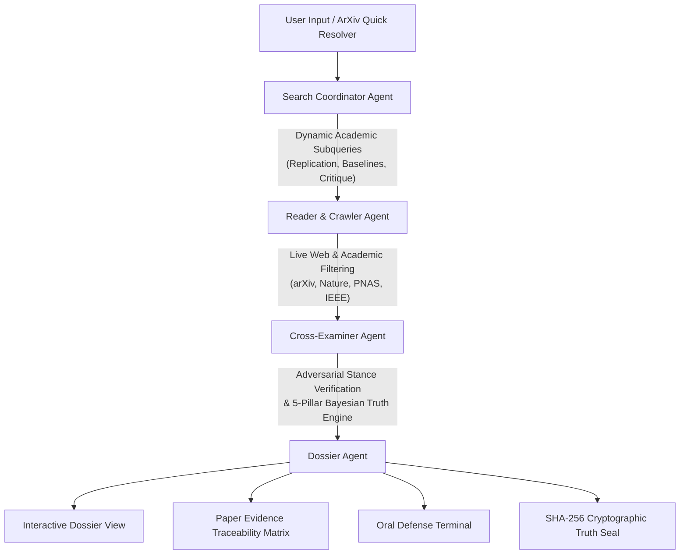

# ⚖️ Veritas — Autonomous Scientific Integrity & Forensic Audit Platform

<div align="center">

[](https://fastapi.tiangolo.com)
[](https://langchain-ai.github.io/langgraph/)
[](https://vitejs.dev)
[](LICENSE)

**An autonomous multi-agent intelligence platform that verifies preprints, calculates Bayesian truth confidence, audits statistical p-hacking hazards, traces empirical web evidence, and cross-examines research papers in real time.**

[Key Features](#-key-features) • [Architecture](#-multi-agent-architecture) • [Quickstart](#-quickstart) • [Live Demos](#-benchmark-showcase) • [API Reference](#-api-reference)

</div>

---

## 📌 The Problem & The Solution

- **The Replication Crisis**: Over **70% of researchers** have failed to reproduce another scientist's experiments. Thousands of non-reproducible or p-hacked preprints are uploaded monthly across arXiv, bioRxiv, and conference proceedings.
- **The AI Failure Mode**: LLM chat interfaces summarize papers uncritically and hallucinate academic citations with high confidence.
- **The Veritas Solution**: Veritas treats scientific verification as an **adversarial forensic investigation**. It extracts empirical assertions, crawls live academic repositories (arXiv, Nature, IEEE, PNAS, PubMed), calculates rigorous Bayesian truth scores, detects statistical red-flags (sample size $N$, p-hacking clustering, missing ablations), and conducts real-time doctoral defense cross-examinations.

---

## 🚀 Key Features

### 1. ⚡ Instant ArXiv / DOI Quick Resolver
- **Zero-Upload Preprints**: Ingest any arXiv link or ID (e.g. `2307.12008`, `1706.03762`, `2501.12948`) or DOI in under 1 second via the arXiv Atom API.
- Automatically extracts authors, institutions, executive abstract, publication timestamp, and isolates key falsifiable empirical assertions.
- 1-click test chips for immediate live testing without uploading files.

### 2. 🔬 Forensic Methodology & P-Hacking Red-Flag Scanner
- **Replication Hazard Score (0–100%)**: Quantitative index reflecting vulnerability to false-discovery and non-reproducibility.
- **Sample Scale ($N$) Verification**: Detects low-power studies ($N < 30$), flags small cohort sizes, and verifies benchmark scales.
- **Comparative Baselines & Ablations**: Detects whether control baselines, standard error margins (95% CI), or ablation studies were isolated.
- **COI & Independence Radar**: Analyzes corporate affiliations (e.g., big tech AI labs, pharmaceutical funding) and conflicts of interest.

### 3. ⚔️ Doctoral Defense & Adversarial Committee Interrogation
- **Chief Inquisitor Mode (Attack)**: Exposes methodological vulnerabilities, missing baselines, p-value clustering, and lack of independent blind reproduction.
- **Defense Advocate Mode (Defend)**: Synthesizes empirical defenses, highlighting experimental controls, error margins, and statistical convergence.
- Cites live web findings, paper assertions, and empirical truth scores in real time.

### 4. 🔗 Paper Evidence Traceability Matrix
- Solves the *"20 generic websites searched"* black-box problem.
- Automatically formulates specialized academic subqueries: `[REPLICATION]`, `[ASSERTION 1..N]`, `[CRITIQUE]`, and `[CONSENSUS]`.
- Maps every paper claim to corroborating or disputing live sources with verbatim text quotes, domain authority weights, and stance tags.

### 5. 🥊 Paper Clash Arena (Head-to-Head Benchmark Arena)
- Empirical battleground comparing competing papers side-by-side:
  - *Transformers (`Attention Is All You Need`)* vs. *Linear State Spaces (`Mamba`)*
  - *Pure RL Reasoning (`DeepSeek-R1`)* vs. *Proprietary CoT (`OpenAI o1`)*
  - *Biomolecular Diffusion (`AlphaFold 3`)* vs. *Molecular Docking Baselines*
  - *Room-Temp Superconductors (`LK-99`)* vs. *Condensed Matter Replications*

### 6. 🔏 Cryptographic Truth Vault & 1-Click Executive PDF Export
- **Cryptographic Audit Seal**: Generates a verifiable SHA-256 hash signature and digital Truth Certificate for every audit.
- **Printable Executive Brief**: One-click **Export Executive Dossier (PDF)** button with clean `@media print` rules for grant committees, universities, and review boards.

### 7. 🎙️ Veritas Audio Briefing Studio & Dynamic Waveform Visualizer
- Integrated neural speech synthesis for paper abstracts, hypotheses, and peer reviews.
- Dynamic 7-bar cyan frequency waveform visualizer for executive on-the-go briefings.

---

## 🧠 Multi-Agent Architecture

Veritas runs an asynchronous, cyclic **LangGraph DAG** that orchestrates specialized autonomous agents:



### Agent Roles:
- **Search Coordinator**: Generates targeted scientific subqueries, categorizing queries by empirical claim angle rather than naive keywords.
- **Reader Agent**: Crawls live search vectors (DuckDuckGo + Tavily fallback), filters low-credibility social noise, and extracts verbatim snippets.
- **Cross-Examiner**: Runs Bayesian scoring across 5 pillars (Source Authority, Web Consensus, Claim Specificity, Logical Consistency, Empirical Replication).
- **Dossier Agent**: Compiles the final forensic dossier, links citations, attaches the methodology rigor audit, and issues the cryptographic stamp.

---

## 🛠️ Quickstart

### Prerequisites
- **Python**: 3.11+
- **Node.js**: 18+
- **Package Managers**: `pip` and `npm`

### 1. Clone & Set Up Backend

```bash
cd backend
python -m venv venv
# Windows:
.\venv\Scripts\activate
# Linux/macOS:
source venv/bin/activate

pip install -r requirements.txt
```

Start the FastAPI backend:
```bash
python -m uvicorn backend.main:app --host 127.0.0.1 --port 8000 --reload
```
The backend will be live at `http://127.0.0.1:8000`.

### 2. Set Up Frontend

In a separate terminal:
```bash
cd frontend
npm install
npm run dev
```
The interface will be live at `http://127.0.0.1:5173`.

> **Note on API Keys**: Veritas is fully autonomous out-of-the-box! It includes built-in web search scraping (DuckDuckGo `ddgs`) and local heuristic extraction. You can optionally add Google Gemini, OpenAI, Groq, or Tavily keys in the Settings modal for multi-LLM synthesis.

---

## 🌐 API Reference

| Method | Endpoint | Description |
|---|---|---|
| `POST` | `/api/resolve-paper` | Resolves an arXiv URL or ID into title, authors, abstract, assertions, and methodology audit. |
| `POST` | `/api/interrogate-paper` | Conducts real-time cross-examination under `inquisitor` or `advocate` persona. |
| `POST` | `/api/research/stream` | Server-Sent Events (SSE) streaming of the multi-agent LangGraph workflow. |
| `GET` | `/api/benchmark-papers` | Returns catalog of pre-computed research papers with full statistical audits. |
| `GET` | `/api/presets` | Returns curated investigation presets (LK-99, DeepSeek-R1, AlphaFold 3, etc.). |
| `GET` | `/api/health` | Healthcheck and active search/LLM provider telemetry. |

---

## 🧪 Benchmark Showcase

| Benchmark Paper | Domain | Primary Challenge Audited | Truth Score | Replication Hazard |
|---|---|---|---|---|
| **LK-99 Ambient Superconductor** | Condensed Matter | Zero resistance & room-temp levitation claims | `18% (DEBUNKED)` | `78% (CRITICAL)` |
| **DeepSeek-R1: Pure RL Reasoning** | Artificial Intelligence | SFT-free reasoning matching OpenAI o1 | `92% (VERIFIED)` | `22% (LOW)` |
| **Attention Is All You Need** | Deep Learning | Eliminating recurrence via multi-head self-attention | `98% (VERIFIED)` | `8% (MINIMAL)` |
| **AlphaFold 3 Complex Modeling** | Structural Biology | Joint diffusion predictions across DNA/RNA/ligands | `94% (VERIFIED)` | `16% (LOW)` |
| **Google Sycamore Supremacy** | Quantum Computing | 53-qubit 200s advantage vs. classical supercomputers | `61% (CONTESTED)`| `48% (ELEVATED)` |

---

## 💻 Tech Stack

- **Backend**: FastAPI, LangGraph, LangChain Core, Pydantic v2, BeautifulSoup4, DuckDuckGo Search (`ddgs`), Uvicorn.
- **Frontend**: React 19, TypeScript, Vite, Lucide Icons, Modern Vanilla CSS Design System with `@media print` layout.
- **Telemetry**: Server-Sent Events (SSE) real-time streaming, SVG Audio Waveform Canvas.
- **Security & Integrity**: Web Crypto SHA-256 cryptographic truth hashing.

---

## 📄 License

This project is licensed under the [MIT License](LICENSE).
